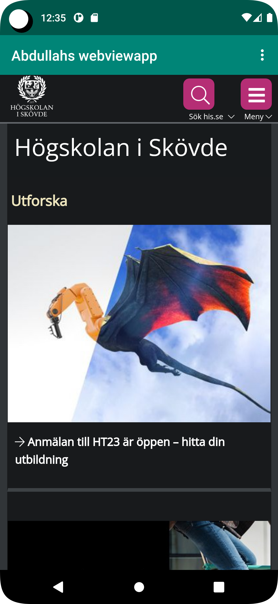
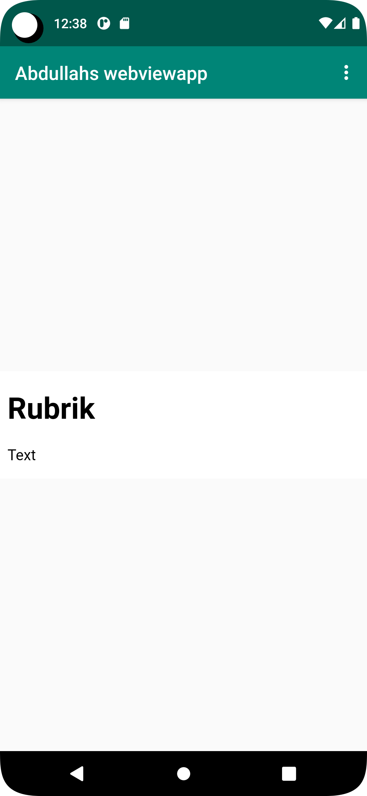

# Rapport

**I started by forking the project from GitHub to Android Studio, after that I copied the link, opened the project, and then started doing what was required of me in the task.
First, I renamed the app to (Abdullahs webviewapp)
In the second step I copied "<uses-permission android:name="android.permission.INTERNET" />" so I can enable internet.
Third, I replaced TextView to Webview.android:id="@+id/my_webview in Activaty_main.xml .
Fifth I added this code private WebView myWebView; myWebView = findViewById(R.id.my_webview); , myWebView.setWebViewClient(new WebViewClient());  , myWebView.loadUrl("https://his.se"); in MainActivity.java.
then i enabled Javascript execution in WebViewClient by adding WebSettings webSettings = myWebView.getSettings(); , webSettings.setJavaScriptEnabled(true); .
After this step, I run my program and saw that I can access the university page.
then i added a HTML page and i Implement External and InternalWebPage.
myWebView.loadUrl("https://his.se");
myWebView.loadUrl("file:///android_asset/Abdullah.HTML"); then i call this onOptionsItemSelected in this method.

**
````

<string name="app_name">Abdullahs webviewapp</string>

````
````
android:id="@+id/my_webview"
````
````
<!Doctype html >
<html>
<h1>Rubrik</h1>
<p>Text</p>

</html>
````
````
private WebView myWebView;
        myWebView.loadUrl("https://his.se");
myWebView.loadUrl("file:///android_asset/Abdullah.HTML");

        myWebView = findViewById(R.id.my_webview);
        myWebView.setWebViewClient(new WebViewClient()); // Do not open in Chrome!

        WebSettings webSettings = myWebView.getSettings();
        webSettings.setJavaScriptEnabled(true);
        
        showExternalWebPage();
        showInternalWebPage();
````


Bilder läggs i samma mapp som markdown-filen.




